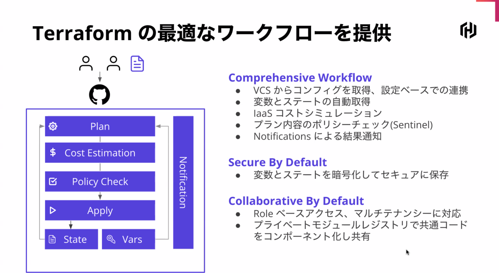
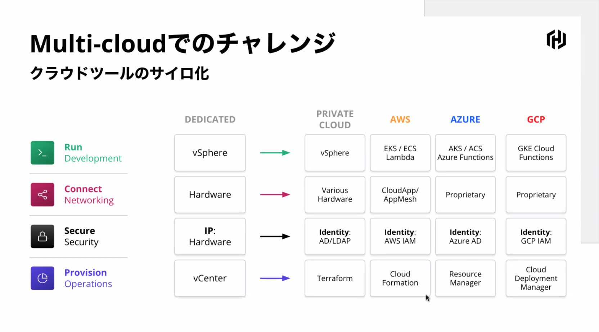

---

layout: post
author: T Kumagai
Title: HashiCorp Terraform Cloud on Azure ワークショップ
categories: [HashiCorp]

tags: [Terraform, Azure, Github, GitOpt, Cloud]

---
# HashiCorp Terraform Cloud on Azure Workshop

- HashiCorp Japan 
  - 伊藤仁智(Masa Ito)
  - @unagi_ga_suki
  - <https://github.com/masatomo-ito2>


## 事前準備

- [Instrqut Account](https://play.instruqt.com/signup)

- [Teraform Cloud Account](https://app.terraform.io/signup/account)

## ミッション

### Unlocking Cloud Operating Model.
1. アプリケーションを実行する
2. 
3. 

### キー製品
* Terraform
* Vault
* Nomad
* Consul
* Vagrant
* Packer
* Boundary
* Waypoint

## 概要

### Cloud, そしてMulti-Cloudへ

* Run(Development) -> さまざまなプラットフォームでの実行
* Connnect(Networking) -> サービスベース
* Secure(Security) -> 低信頼性
* Provision(Operations) -> オンデマンド

### クラウドツールのサイロ化



### Multi-cloudでのチャレンジ



ワークフローの統一

ハイブリッドなインフラへのシフト

### IAC Provision

Practitioner -> Infrastructure as Code -> Plan -> Apply -> Provider

* インフラをコードで管理
* 冪等性
* 再利用性
* 使い慣れたGitなどによるコード管理
* チーム間でのコラボレーション
* コードレビューやポリシーチェックによりミスオペを防ぐ

### Teraform OSS
* aws
* gcp
* azure
* vmware
* f5
* DATADOG

### 問題
* Stateの共有に工夫がいる
* コード共有どうする？
* バージョン管理どうする?


**そこで👇👇👇👇👇👇👇👇👇👇👇👇👇👇👇👇👇👇👇👇**

### Teraform Cloud

GitOpsとWorkspaceとの連携


|Stack|
|--|
|State-File|
|Variables|
|RBAC|
|Workflow|
|Notifications|
|and more..|


#### さまざまなワークフローに対応

* VCS
* CLI
* API
* Web-UI

-----------

## Handson

* Instruqtのアカウント作成
  InstruqtのTrack URL
  [play]<https://play.instruqt.com/hashicorp/invite/x5yxsmogi3xy>


### 

terraform init - terraform plan - terraform variables

* Terraform Variables
  * .trvars に記述
  * Consoleから

```trvars
root@workstation:~/hashicat-azure# cat terraform.tfvars
# Rename or copy this file to terraform.tfvars
# Prefix must be all lowercase letters, digits, and hyphens.
# Make sure it is at least 5 characters long.

prefix = "friendbear"
location = "Japan West"
```

## COMについて

## Teraformレクチャー１

## Lab1

## Teraformレクチャー２

## Lab2

--------------
## Discussion

* 全体的にFirefoxで動作しない問題
* GitOptでPR時に `terraform plan` のみ実行させる方法
* Cloud-Initとの棲み分け
* Vagrantの今後の位置付け

-----------

## Handson 抜粋

```text
📒 Terraformのステートファイルを守る！

ここでのチャレンジは、Terraform Cloud アカウントを使用してリモートステートを設定することです。このチャレンジを完了するためには、以下のものが必要です。

    無料のTerraform Cloudアカウント - https://app.terraform.io
    yourname-trainingという Organization。これは前の演習で作成したものになります。
    hashicat-azureという名前のワークスペースで、Execution Mode をLocal（Remoteではない）に設定します。
    認証用のUserトークン
    ワークスペースに保存されているremote_backend の設定。

ワークステーションで使用する新しいUser　トークンを生成してみましょう。Terraform Cloudの「User Settings > Tokens」ページにアクセスします。

https://app.terraform.io/app/settings/tokens

Create an API tokenボタンをクリックします。トークンには好きな名前をつけることができます。トークン全体をマウスまたは小さなコピーペーストアイコンでコピーします。

Instruqt トラックに戻って、API トークンをcredentials.tfrc.json というファイルに追加します。

「Credentials File」 タブを選択し、/root/.terraform.d/credentials.tfrc.json ファイルを直接開くことが出来ます。

YOURTOKEN と書かれている部分をTerraform Cloud からコピーしたものに置き換えます。「Credentials File」 タブを使用する場合は、必ずファイルを保存してください。

これでトークンがcredentials.tfrc.json ファイルに安全に保存されました。

エディターに戻り、remote_backend.tf ファイルを編集し、"YOUR Organization " プレースホルダーをご自身のOrganization　名に置き換えます。

エディターで、terraform.tfvars ファイルを編集して、prefixをあなたの名前（名字と名前の間にハイフンがあってもなくてもよく、すべて小文字）にしてください。 prefixはホストネームとして利用されるので、DNSセーフな文字列にしてください。アンダースコアなどは使わないでください。

locationを "East US"、"Japan East"、"Japan West"のような有効なAzure locationに設定してください。

各行から「#」を削除して、変数の値のコメントを解除します。

変数は実際には variables.tf ファイルで宣言されています。terraform.tfvars ファイルは、それらの値を設定するために使われているだけです。

すべての要素がそろったら、「Shell」タブでterraform initとterraform applyコマンドを実行してみてください。

terraform init
terraform apply

Terraform からapply　の確認を求められたら、"Shell "タブでyesと入力することを忘れないでください。

terraform apply が終了すると、以下のような出力が表示されるはずです。

Apply complete! Resources: 8 added, 0 changed, 0 destroyed.

Outputs:

catapp_url = http://masa-meow.japaneast.cloudapp.azure.com

URLをクリックして、アプリケーションが動作するかどうかをテストしてください。もしロードされない場合は、terraform applyコマンドを再度実行してください。通常はこれで解決します。

さらに、Terraform Cloudのワークスペースの"States" タブに新しいステートファイルが表示されているはずです。

注意：リモートバックエンドを設定する前にローカルでterraformを実行した場合、terraform.tfstateというローカルのステートファイルがあるかもしれません。その場合は、rm terraform.tfstateを実行して削除してください。

リモートステートを有効にした hashicat アプリケーションのデプロイに成功したら、下のCheck ボタンを押して下さい。

ウェブブラウザで hashicat アプリケーションをご覧になりたい場合は、Terraform 実行の出力結果からリンクをコピーして、別のタブまたはウィンドウのURLバーに貼り付けてください。
```